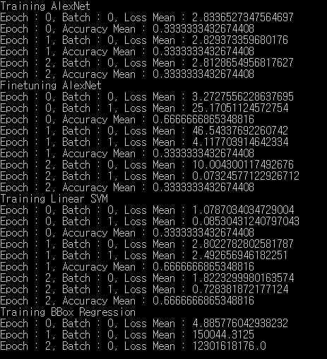
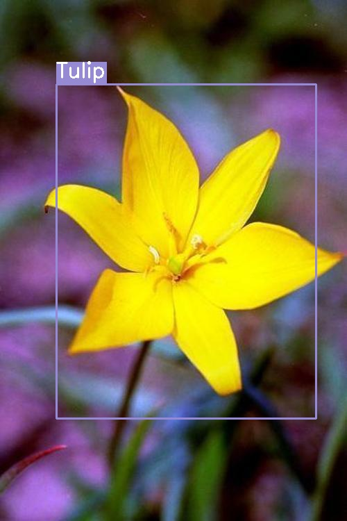

Object Detection using Tensorflow R-CNN
===========================================

Tensorflow implementation of Regions with Convolutional Neural Networks Features.
http://www.rossgirshick.info/  
Using 17 Category Flower Dataset.
http://www.robots.ox.ac.uk/~vgg/data/flowers/17/
	
	Rich Feature Hierarchies for Accurate Object Detection and Semantic Segmentation
	R. Girshick, J. Donahue, T. Darrell, J. Malik
	IEEE Conference on Computer Vision and Pattern Recognition (CVPR), 2014

Training Usage
-----

    python TrainingModel.py train_data_file finetune_data_file max_epoch batch_size
    	output_cnn_model_file output_cnn_mean_file output_svm_model_file output_reg_model_file
    
    ex)
    python TrainingModel.py ./data/train_data.txt ./data/finetune_data.txt 3 3
    	./alexnet/alexnet_model.npy ./alexnet/alexnet_mean.txt ./svm/svm_model.npy ./bbox/bbox_model.npy

Training Result
-----

Detection Usage
-----

    python DetectionImage.py cnn_model_file cnn_mean_file svm_model_file
    	reg_model_file label_file input_image_file output_image_file
    
    ex)
    python DetectionImage.py ./alexnet/alexnet_model.npy ./alexnet/alexnet_mean.txt ./svm/svm_model.npy
    	./bbox/bbox_model.npy ./alexnet/flower_classes.txt ./example/tulip.jpg ./example/tulip_result.jpg

Detection Result
-----

 
